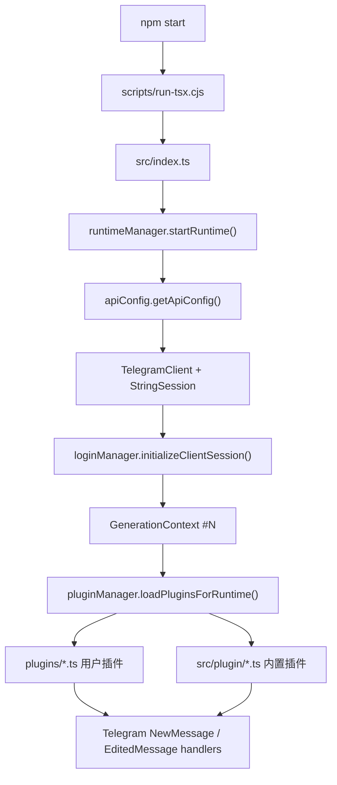
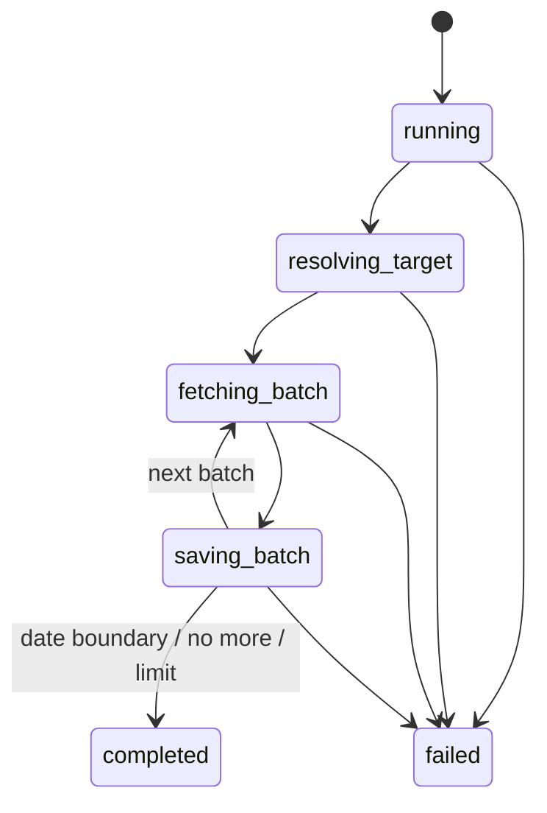

# TeleBox Reverse Engineering Analysis / 逆向分析笔记

> Goal: provide a roadmap for building your own version. Current branch:
> `feature/TelegramUserbot/Leeching/V1Telebox`, direction: Telegram Userbot / Leeching / V1Telebox.
>
> 目标：给后续做自己的版本做路线图。当前工作分支为 `feature/TelegramUserbot/Leeching/V1Telebox`，方向是 Telegram Userbot / Leeching / V1Telebox。

## 0. Current Pull State / 当前拉取状态

| Item / 项目 | Value / 值 |
|---|---|
| Local path / 本地路径 | `C:\Users\user\Desktop\TP AI Agent\TeleBox_reverse\TeleBox` |
| Git remote | `https://github.com/TeleBoxOrg/TeleBox.git` |
| Current branch / 当前分支 | `feature/TelegramUserbot/Leeching/V1Telebox` |
| Current commit | `6902a3513420195aa9b9bd9077ce0ec14163d0ad` |
| Project version / 项目版本 | `telebox@0.2.8` |
| License | `LGPL-2.1-only` |
| Node requirement / Node 要求 | `24.x` |
| Telegram client lib / Telegram 客户端库 | `teleproto ^1.227.1` |

## 1. Architecture Summary / 一句话架构

TeleBox is a **Node.js + TypeScript + teleproto** Telegram UserBot framework:

TeleBox 是一个 **Node.js + TypeScript + teleproto** 的 Telegram UserBot 框架：

1. `src/index.ts` — entry point, loads env/logger/patches, starts runtime. / 入口，加载环境变量、logger、patch，启动 runtime。
2. `src/utils/runtimeManager.ts` — creates `TelegramClient`, restores session, builds `GenerationContext`. / 创建 TelegramClient，恢复 session，建立 GenerationContext。
3. `src/utils/pluginManager.ts` — dynamically loads plugins, registers commands/events/cron. / 动态加载插件，注册命令/事件/cron。
4. Plugins extend `Plugin` from `src/utils/pluginBase.ts`, expose `cmdHandlers`. / 插件继承 Plugin，通过 cmdHandlers 暴露命令。
5. Runtime data stored in `config.json`, `assets/*`, `temp/*`. / 运行期数据存储在 config.json、assets、temp。



## 2. 启动与运行时链路

### 2.1 入口：`src/index.ts`

- `import "dotenv/config"`：读取 `.env`。
- 初始化 `logger`。
- 引入 `./hook/patches/telegram.patch`：patch HTML parser 和 Message 原型方法。
- 注册 `unhandledRejection` / `uncaughtException`。
- 调用 `startRuntime()`。

### 2.2 Runtime：`src/utils/runtimeManager.ts`

核心函数：

- `createClient()`：读取 `config.json` 中的 `api_id/api_hash/session/proxy`，创建 `TelegramClient(new StringSession(...))`。
- `buildRuntime()`：创建新的 `GenerationContext`，连接 Telegram，注册断线 watchdog。
- `startRuntime()`：首次启动。
- `reloadRuntime()`：完整重载：卸载旧插件 -> drain/销毁旧 client -> 创建新 client/generation -> 重新加载插件。
- `shutdownRuntime()`：退出清理。

关键概念：**GenerationContext 是每次 runtime 的生命周期容器**。写 leech/download/upload 这类长任务时，必须把下载 promise、timer、子进程、listener 都绑定到当前 generation，避免 reload 后旧任务残留。

### 2.3 登录与 session

相关文件：

- `src/utils/apiConfig.ts`
- `src/utils/loginManager.ts`

运行后会自动创建/读取 `config.json`：

```json
{
  "api_id": 123456,
  "api_hash": "xxxx",
  "session": "xxxx",
  "proxy": {}
}
```

注意：真实 `config.json` 不能提交。

## 3. 插件系统逆向重点

### 3.1 插件最小形态

```ts
import { Plugin } from "@utils/pluginBase";
import { Api } from "teleproto";

class MyPlugin extends Plugin {
  description = "说明";

  cmdHandlers: Record<string, (msg: Api.Message, trigger?: Api.Message) => Promise<void>> = {
    mycmd: async (msg) => {
      await msg.edit({ text: "ok" });
    },
  };
}

export default new MyPlugin();
```

可选字段：

- `listenMessageHandler(msg, options)`：全局消息监听。
- `eventHandlers`：直接注册 teleproto event builder。
- `cronTasks`：定时任务。
- `setup(context)` / `cleanup()`：生命周期初始化和清理。
- `ignoreEdited`：命令是否忽略编辑消息，默认来自 `TB_CMD_IGNORE_EDITED`。

### 3.2 插件加载顺序

`loadPluginsForRuntime()` 的顺序：

1. 加载 `plugins/*.ts` 用户插件。
2. 加载 `src/plugin/*.ts` 内置插件。
3. 对每个插件执行 `setup()`。
4. 注册根命令监听：`NewMessage` 和 `EditedMessage`。
5. 注册插件级 `listenMessageHandler`、`eventHandlers`、`cronTasks`。

注意：如果用户插件与内置插件命令同名，后加载的内置插件可能覆盖前面的命令映射。要覆盖内置命令时，建议改 `src/plugin` 或调整加载策略。

### 3.3 命令触发逻辑

`dealCommandPlugin()` 只处理：

- `msg.out`：自己发出的消息。
- 或 `savedPeerId`：收藏/保存消息场景。

默认前缀：

- 生产：`.`, `。`, `$`
- 开发模式：`!`, `！`
- 可由 `.env` 的 `TB_PREFIX` 覆盖。

## 4. 内置插件地图

| 文件 | 主要命令 | 作用 | 逆向价值 |
|---|---|---|---|
| `src/plugin/help.ts` | `help`, `h` | 帮助系统 | 看插件枚举与 description 输出 |
| `src/plugin/alias.ts` | `alias` | 命令别名 | 看 SQLite 与多词命令重写 |
| `src/plugin/prefix.ts` | `prefix` | 设置命令前缀 | 看运行时配置修改 |
| `src/plugin/sudo.ts` | `sudo` | sudo 用户/群权限 | 看权限和代执行模型 |
| `src/plugin/sure.ts` | `sure` | 白名单/确认消息机制 | 看 listener + DB 规则匹配 |
| `src/plugin/re.ts` | `re` | 回复消息复读 | 看 reply message 获取 |
| `src/plugin/debug.ts` | `id`, `entity` | 用户/群/频道/link 解析 | Telegram entity 逆向重点 |
| `src/plugin/ping.ts` | `ping` | API/ICMP/DC 延迟测试 | 看网络诊断与 child process |
| `src/plugin/exec.ts` | `exec` | Telegram 执行 shell | 高风险能力；看子进程生命周期 |
| `src/plugin/status.ts` | `status`, `sysinfo` | 系统状态 | 看运行状态聚合 |
| `src/plugin/reload.ts` | `reload` | 插件/进程重载 | 看 runtime reload 边界 |
| `src/plugin/update.ts` | `update` | git 更新 + npm install | 二开时建议改 remote/branch 逻辑 |
| `src/plugin/tpm.ts` | `tpm` | 远程插件安装/卸载/搜索 | 看插件生态和外部下载 |
| `src/plugin/bf.ts` | `bf`, `hf` | 备份/恢复 plugins + assets | 对 leech 文件打包/上传有参考价值 |
| `src/plugin/sendLog.ts` | `sendlog`, `logs`, `log` | 发送日志文件 | 对文件发送、目标配置有参考价值 |
| `src/plugin/loglevel.ts` | `loglevel` | 调整日志等级 | 看 logger 持久化配置 |

用户插件例子：

- `plugins/moyu.ts`：下载外部图片 API -> 封装 `CustomFile` -> `sendFile()` 到 Telegram -> 删除命令消息。

## 5. 数据与持久化

| 数据 | 文件/目录 | 说明 |
|---|---|---|
| Telegram API/session | `config.json` | 运行后自动创建，不要提交真实 session |
| 环境变量样例 | `.env-sample` | `TB_PREFIX`, `TB_SUDO_PREFIX`, `TB_CMD_IGNORE_EDITED`, `TB_LISTENER_HANDLE_EDITED` |
| alias DB | `assets/alias/alias.db` | better-sqlite3 |
| sudo DB | `assets/sudo/sudo.db` | 用户/群授权 |
| sure DB | `assets/sure/sure.db` | 用户/群/消息规则 |
| sendlog DB | `assets/sendlog/sendlog.db` | 日志发送目标 |
| logger 配置 | `assets/logger/config.json` | lowdb JSON |
| reload 配置 | `assets/reload/config.json` | lowdb JSON |
| tpm 插件索引缓存 | `assets/tpm/plugins.json` | 远程插件索引缓存 |
| 临时文件 | `temp/*` | 下载/解压/运行临时文件建议放这里 |

## 6. Leeching/V1Telebox V1 落地说明

本分支已把 V1 做成内置插件：`src/plugin/leech.ts`，核心工具放在 `src/utils/leech/*`。

配套文档：

- `LEECH_README.md`
- `LEECH_ARCHITECTURE.md`
- `LEECH_FEATURES.md`

验证脚本：

- `npm run leech:smoke`：使用 fake Telegram client 验证 SQLite/structured log/date range 保存链路，并覆盖 `.leech login/chat/jobs/stats/db` 插件命令入口。

### 6.1 V1 功能边界

当前 V1 稳定闭环：

- `.leech login` / `.leech session`：检查当前 Telegram session。
- `.leech chat <target> --from YYYY-MM-DD --to YYYY-MM-DD`：按日期范围抓 chat/group/channel 消息。
- `.leech jobs [limit]`：查看最近任务。
- `.leech stats`：查看 SQLite 保存统计。
- `.leech db`：查看本地 DB 路径。

消息保存到 `assets/leech/leech.db`，structured log 同时输出到 console 和 `leech_actions` 表。

### 6.2 推荐模块拆分

```text
src/plugin/leech.ts
src/utils/leech/types.ts
src/utils/leech/dateRange.ts
src/utils/leech/json.ts
src/utils/leech/leechDB.ts
src/utils/leech/structuredLogger.ts
src/utils/leech/targetResolver.ts
src/utils/leech/messageSerializer.ts
src/utils/leech/leechService.ts
```

### 6.3 必须复用的现有能力

- `GenerationContext`
  - 抓取 batch：`lifecycle.runTask(...)`
  - timeout/timer：`lifecycle.setTimeout(...)`
  - 后续如接外部下载器子进程：`lifecycle.trackChildProcess(...)`
- `pathHelpers`
  - 配置/DB：`createDirectoryInAssets("leech")`
- `safeGetMessages.ts`
  - 分批读取 Telegram 历史消息并保护已知 getMessages 崩溃。
- `better-sqlite3`
  - 保存 jobs/messages/actions 三类本地数据。

### 6.4 Leeching 状态机



### 6.5 重点坑位

1. **重载后旧任务残留**：所有下载/upload/timer 必须绑定当前 `GenerationContext`。
2. **命令只处理自己发出的消息**：这是 userbot，不是 bot token bot。
3. **大范围抓取限制**：Telegram API 有 rate limit，大范围建议分段日期跑。
4. **DB 体积增长**：`raw_json` 会增加 DB 体积，后续可加压缩/导出/清理策略。
5. **不要提交 session**：`config.json`、`assets/*.db`、`temp/*` 不要进 git。
6. **自更新插件会改 git**：`update.ts` 会 fetch/pull/reset；二开分支建议先禁用或改 remote/branch 逻辑。
7. **exec 插件风险高**：个人版本可保留，公开发布建议默认禁用或加强权限。
8. **License**：原仓库是 LGPL-2.1-only，fork 改动要保留版权与许可证声明。

## 7. 推荐逆向阅读顺序

1. `package.json`、`tsconfig.json`
2. `src/index.ts`
3. `src/utils/runtimeManager.ts`
4. `src/utils/apiConfig.ts`、`src/utils/loginManager.ts`
5. `src/utils/pluginBase.ts`
6. `src/utils/pluginManager.ts`
7. `plugins/moyu.ts`
8. `src/plugin/sendLog.ts`、`src/plugin/bf.ts`
9. `src/plugin/tpm.ts`
10. `src/utils/generationContext.ts`
11. `src/plugin/exec.ts`、`src/plugin/reload.ts`

## 8. 后续本地命令

```powershell
cd "C:\Users\user\Desktop\TP AI Agent\TeleBox_reverse\TeleBox"
git status --short --branch
npm install
npm run dev
```
