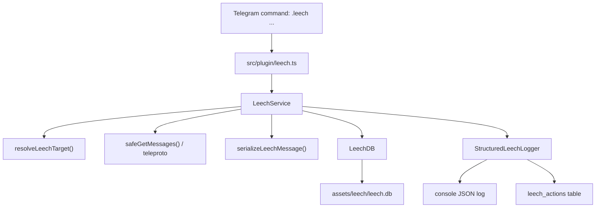
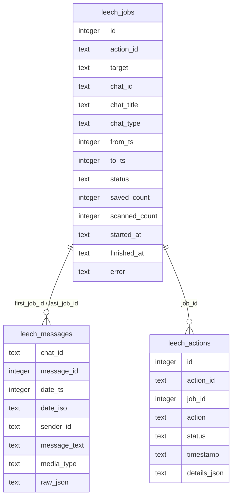
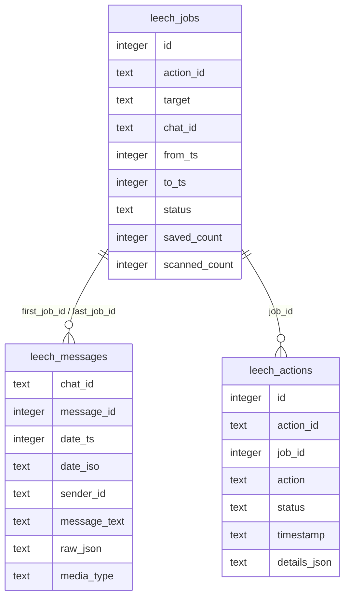

# TeleBox Leech V1 架构设计

## 1. 目标

在 TeleBox 原有 runtime/plugin 架构中加入一个可维护的 leech 模块，实现：

- 复用 TeleBox Telegram session。
- 按日期范围抓取 chat/group/channel 消息。
- 保存到本地 SQLite。
- 每个关键 action 结构化记录。
- 插件代码可继续扩展到 media/file leech、导出、增量同步。

## 2. 模块图



## 3. 文件职责

| 文件 | 责任 |
|---|---|
| `src/plugin/leech.ts` | Telegram 命令入口、参数解析、用户反馈 |
| `src/utils/leech/leechService.ts` | 核心 leech 流程：resolve target、分页抓取、保存、状态更新 |
| `src/utils/leech/leechDB.ts` | SQLite schema 与读写封装 |
| `src/utils/leech/structuredLogger.ts` | JSON structured log 输出 + action 持久化 |
| `src/utils/leech/targetResolver.ts` | target 解析：here、@username、数字 ID、t.me link |
| `src/utils/leech/messageSerializer.ts` | Telegram Message -> SQLite row |
| `src/utils/leech/dateRange.ts` | 日期范围解析 |
| `src/utils/leech/json.ts` | 安全 JSON 序列化、ID/number 转换 |
| `src/utils/leech/types.ts` | 类型定义 |
| `scripts/leech-smoke.ts` | 本地 smoke 验证脚本，不连接 Telegram |

## 4. 数据流

1. 用户发送 `.leech chat ...`。
2. `src/plugin/leech.ts` 解析参数。
3. `LeechService.runChatLeech()` 创建 `actionId`。
4. `resolveLeechTarget()` 把输入转换成 Telegram entity。
5. `LeechDB.createJob()` 创建 job。
6. 使用 `safeGetMessages()` 分批抓取消息。
7. 每批消息经过 `serializeLeechMessage()` 转换。
8. `LeechDB.upsertMessage()` 写入 `leech_messages`。
9. 每个关键 action 调 `StructuredLeechLogger.log()`：
   - console 输出 JSON
   - 写入 `leech_actions`
10. 任务完成后更新 `leech_jobs.status = completed`。

## 5. 日期范围策略

Telegram message history 默认从新到旧读取。

Leech V1 使用：

- `offsetDate = toTs + 1`
- `offsetId = lastMessage.id`
- 循环抓取直到：
  - 到达 `fromTs` 边界
  - 没有更多消息
  - 达到 `--limit`
  - runtime 被 abort/reload

`--from YYYY-MM-DD` 会转换为当天 `00:00:00`。  
`--to YYYY-MM-DD` 会转换为当天 `23:59:59.999`。

## 6. Lifecycle / reload 设计

TeleBox 有 `GenerationContext`，每次 runtime reload 都会创建新 generation。

Leech V1 在抓取 batch 时使用：

```ts
lifecycle.runTask(...)
```

这样 runtime reload/shutdown 时可以触发 abort/drain，避免旧抓取任务长期悬挂。

## 7. SQLite schema



## 8. 后续扩展点

- 增量同步：记录每个 chat 上次抓取到的 message_id/date。
- Media 下载：把 photo/document/video 下载到 `temp/leech_media` 或 `assets/leech_media`。
- 导出：支持 `.leech export csv/json`.
- 查询：支持 `.leech search keyword`.
- 多任务队列：加入 concurrency control 和 cancel job。

## 9. 验证策略

当前可自动验证的部分：

```powershell
npx tsc --noEmit
npm run leech:smoke
```

- `npx tsc --noEmit` 验证 TypeScript 类型。
- `npm run leech:smoke` 使用 fake Telegram client 验证：
  - 日期范围分页
  - SQLite job/message/action 写入
  - structured log 持久化
  - stats 读取
  - 插件命令入口：`.leech login`、`.leech chat`、`.leech jobs`、`.leech stats`、`.leech db`

真实 Telegram 抓取仍需要有效 `config.json` session，并在 Telegram 内执行 `.leech chat ...` 做联调。
# TeleBox Leech V1 Architecture / 架构设计

## 1. Goal / 目标

Integrate a maintainable leech module into TeleBox's existing runtime/plugin architecture to:

在 TeleBox 原有 runtime/plugin 架构中加入一个可维护的 leech 模块，实现：

- Reuse the TeleBox Telegram session (no separate login). / 复用 TeleBox Telegram session（无需单独登录）。
- Fetch chat/group/channel messages by date range. / 按日期范围抓取 chat/group/channel 消息。
- Save to local SQLite. / 保存到本地 SQLite。
- Structured logging for every key action. / 每个关键 action 结构化记录。
- Extensible to media download, export, incremental sync. / 可扩展到 media 下载、导出、增量同步。

## 2. Module Map / 模块图


## 3. File Responsibilities / 文件职责

| File / 文件 | Responsibility / 职责 |
|---|---|
| `src/plugin/leech.ts` | Telegram command entry, argument parsing, user feedback / Telegram 命令入口、参数解析、用户反馈 |
| `src/utils/leech/leechService.ts` | Core leech flow: resolve target, fetch in batches, save, update status / 核心抓取流程 |
| `src/utils/leech/leechDB.ts` | SQLite schema and CRUD operations / SQLite schema 与读写封装 |
| `src/utils/leech/structuredLogger.ts` | JSON structured log output + action persistence / 结构化日志输出 + 持久化 |
| `src/utils/leech/targetResolver.ts` | Target resolution: here, @username, numeric ID, t.me link / Target 解析 |
| `src/utils/leech/messageSerializer.ts` | Telegram Message -> SQLite row / 消息序列化为 SQLite 行 |
| `src/utils/leech/dateRange.ts` | Date range parsing / 日期范围解析 |
| `src/utils/leech/json.ts` | Safe JSON serialization, ID/number conversion / 安全 JSON 序列化 |
| `src/utils/leech/types.ts` | TypeScript type definitions / 类型定义 |
| `scripts/leech-smoke.ts` | Local smoke test (no Telegram connection) / 本地冒烟测试 |

## 4. Data Flow / 数据流

1. User sends `.leech chat ...` in Telegram. / 用户在 Telegram 发送 `.leech chat ...`。
2. `src/plugin/leech.ts` parses the command arguments. / 插件解析命令参数。
3. `LeechService.runChatLeech()` creates a unique `actionId`. / 服务创建唯一 `actionId`。
4. `resolveLeechTarget()` converts the input to a Telegram entity. / 将输入转换为 Telegram entity。
5. `LeechDB.createJob()` inserts a job row. / 插入 job 行。
6. `safeGetMessages()` fetches messages in batches. / 分批抓取消息。
7. `serializeLeechMessage()` converts each message to a SQLite row. / 每条消息转换为 SQLite 行。
8. `LeechDB.upsertMessage()` writes to `leech_messages`. / 写入 `leech_messages`。
9. Every key action calls `StructuredLeechLogger.log()`: console JSON + `leech_actions` table. / 每个关键动作输出 JSON 日志并写入表。
10. On completion, update `leech_jobs.status = completed`. / 完成后更新 job 状态。

## 5. Date Range Strategy / 日期范围策略

Telegram message history reads from newest to oldest by default. / Telegram 消息历史默认从新到旧读取。

Leech V1 uses:

- `offsetDate = toTs + 1` (exclusive boundary / 排除边界)
- `offsetId = lastMessage.id`
- Loop until: `fromTs` boundary reached / no more messages / `--limit` reached / runtime aborted

`--from YYYY-MM-DD` is converted to `00:00:00`. / 转换为当天 00:00:00。
`--to YYYY-MM-DD` is converted to `23:59:59.999`. / 转换为当天 23:59:59.999。

## 6. Lifecycle / Reload Design / 生命周期与重载设计

TeleBox uses `GenerationContext` for each runtime generation. / TeleBox 使用 `GenerationContext` 管理每次 runtime 代次。

Leech V1 binds batch fetching to the current generation via `lifecycle.runTask(...)`, so a runtime reload/shutdown will trigger abort/drain and prevent stale tasks from hanging.

Leech V1 通过 `lifecycle.runTask(...)` 绑定到当前 generation，runtime reload/shutdown 时会触发 abort/drain，避免旧任务悬挂。

## 7. SQLite Schema / 数据库结构



## 8. Future Extensions / 后续扩展

| Extension / 扩展 | Description / 说明 |
|---|---|
| Incremental sync / 增量同步 | Track last fetched message_id/date per chat / 记录每个 chat 上次抓取位置 |
| Media download / 媒体下载 | Download photo/document/video to `temp/leech_media` / 下载文件到本地 |
| Export / 导出 | `.leech export csv/json` |
| Search / 搜索 | `.leech search keyword` |
| Job queue / 任务队列 | Concurrency control and cancel support / 并发控制与取消 |

## 9. Verification Strategy / 验证策略

```powershell
npx tsc --noEmit          # TypeScript type check / 类型检查
npm run leech:smoke       # Local smoke test / 本地冒烟测试
```

The smoke test uses a fake Telegram client to verify: / 冒烟测试使用 fake Telegram client 验证：

- Date range pagination / 日期范围分页
- SQLite job/message/action persistence / SQLite 持久化
- Structured log output / 结构化日志
- Plugin command entry points: `.leech login/chat/jobs/stats/db` / 插件命令入口

Real Telegram fetching requires a valid `config.json` session and testing `.leech chat ...` in Telegram. / 真实抓取需要有效 session 并在 Telegram 内测试。
